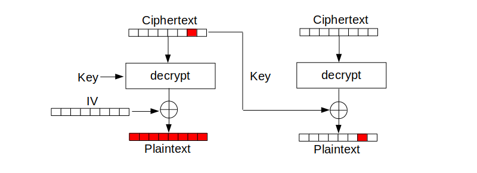
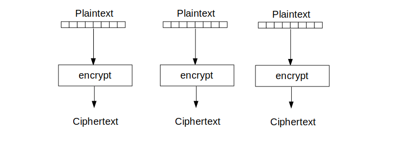
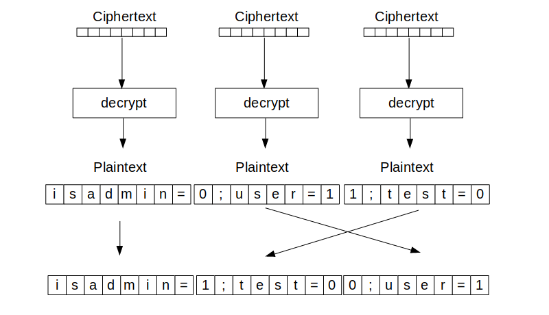
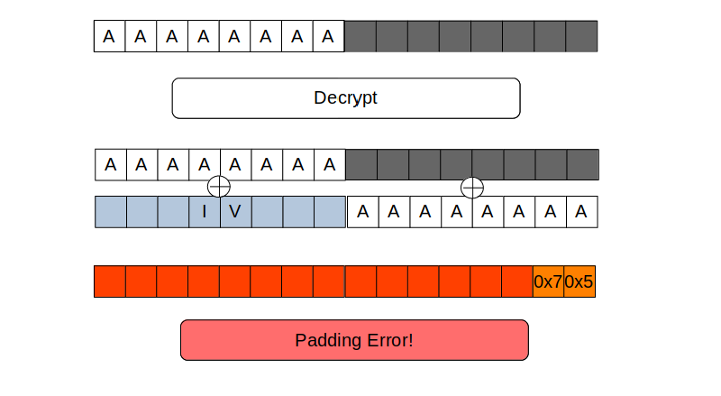
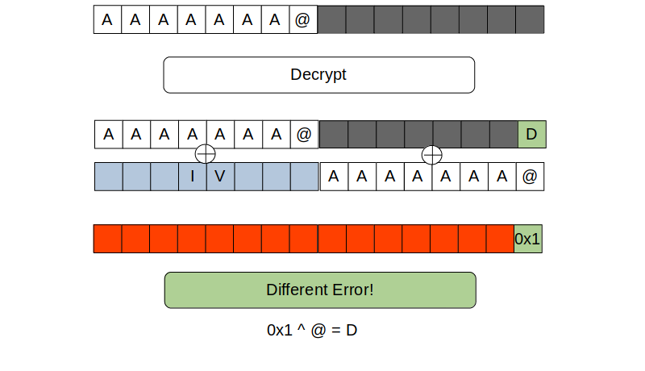

### crypted-cookie-monster

------

*crypted-cookie-monster (ccm)* is a small python tool and library which assists you to identify vulnerabilities around encrypted data.
Initially the tool was designed to test encrypted cookies, but it might also be useful in other situations. Currently, detection
of the following vulnerabilities is supported:

* Bitflipping on CBC ciphers
* Aimed Bitflipping on CBC ciphers
* Block Shuffling on ECB ciphers
* Padding Oracle

Notice that *ccm* was written on the fly and it can certainly be improved by adding and extending certain functionalities.
If you have any ideas for improvements, feel free to contribute or submit an issue!


### Installation

------

1. **Via setup.py**  
    
    To install container-arsenal via *setup.py*, make sure you have Python 3.6 or greater installed. 
    Then run this command from the command prompt:

        $ python3 setup.py install --user


2. **As pip package** (recommended)  

    If you want to generate a pip package instead, run the following command from the command prompt:

        $ python3 setup.py sdist

    You can then install container-arsenal via pip using:

        $ pip3 install dist/ccm-1.0.0.tar.gz --user


### Usage

------

Consider you encounter a web application that sets the following cookie on your first visit:

```http
Set-Cookie: sess=MJEAhaGscNcK6zj0Tj13pocV1q6x7IaVU0AdkJ8hnHZXEfXHpDTU8Pn8BIH7iVBZRzb8NEsA1BAyvxSNjjNJ1ygdj%2BNZzeUGSXn738oV17xhWt1WOYLeC2PFqRyXFZ4o
```

By just using this cookie as a single argument for *ccm*, the tool just prints some general information:

```
[pentester@kali ~]$ ccm MJEAhaGscNcK6zj0Tj13pocV1q6x7IaVU0AdkJ8hnHZXEfXHpDTU8Pn8BIH7iVBZRzb8NEsA1BAyvxSNjjNJ1ygdj%2BNZzeUGSXn738oV17xhWt1WOYLeC2PFqRyXFZ4o
[+] Cookie Size: 96 Byte
[+] Possible block length: 8 Byte
[+] Possible block length: 16 Byte
```

By default, *ccm* tries to identify the correct encoding of the encrypted data on its own and either selects *hex* or *base64* encoding. In the case of *base64*, *ccm* also
detects the usage of *url-encoding* or *websafe base64* automatically and outputs data according to the detected encodings. In general you should never be forced
to select manually between *b64* or *hex* encoding, but you are of course allowed to do so with the ``--encoding`` command line option.

After some more analysis, you think that the cookie stores encrypted information and you want to check for *bitflipping* vulnerabilities.
*ccm*'s bitflipping mode walks over each byte inside the ciphertext and iterates the byte value over all possible values. Of course you
are allowed to restrict the flipping range and values by using the corresponding command line options. A simple
wordlist is generated by the following command:

```
[pentester@kali ~]$ ccm --bit-flip MJEAhaGscNcK6zj0Tj13pocV1q6x7IaVU0AdkJ8hnHZXEfXHpDTU8Pn8BIH7iVBZRzb8NEsA1BAyvxSNjjNJ1ygdj%2BNZzeUGSXn738oV17xhWt1WOYLeC2PFqRyXFZ4o | head 
AJEAhaGscNcK6zj0Tj13pocV1q6x7IaVU0AdkJ8hnHZXEfXHpDTU8Pn8BIH7iVBZRzb8NEsA1BAyvxSNjjNJ1ygdj%2BNZzeUGSXn738oV17xhWt1WOYLeC2PFqRyXFZ4o
AZEAhaGscNcK6zj0Tj13pocV1q6x7IaVU0AdkJ8hnHZXEfXHpDTU8Pn8BIH7iVBZRzb8NEsA1BAyvxSNjjNJ1ygdj%2BNZzeUGSXn738oV17xhWt1WOYLeC2PFqRyXFZ4o
ApEAhaGscNcK6zj0Tj13pocV1q6x7IaVU0AdkJ8hnHZXEfXHpDTU8Pn8BIH7iVBZRzb8NEsA1BAyvxSNjjNJ1ygdj%2BNZzeUGSXn738oV17xhWt1WOYLeC2PFqRyXFZ4o
A5EAhaGscNcK6zj0Tj13pocV1q6x7IaVU0AdkJ8hnHZXEfXHpDTU8Pn8BIH7iVBZRzb8NEsA1BAyvxSNjjNJ1ygdj%2BNZzeUGSXn738oV17xhWt1WOYLeC2PFqRyXFZ4o
BJEAhaGscNcK6zj0Tj13pocV1q6x7IaVU0AdkJ8hnHZXEfXHpDTU8Pn8BIH7iVBZRzb8NEsA1BAyvxSNjjNJ1ygdj%2BNZzeUGSXn738oV17xhWt1WOYLeC2PFqRyXFZ4o
BZEAhaGscNcK6zj0Tj13pocV1q6x7IaVU0AdkJ8hnHZXEfXHpDTU8Pn8BIH7iVBZRzb8NEsA1BAyvxSNjjNJ1ygdj%2BNZzeUGSXn738oV17xhWt1WOYLeC2PFqRyXFZ4o
BpEAhaGscNcK6zj0Tj13pocV1q6x7IaVU0AdkJ8hnHZXEfXHpDTU8Pn8BIH7iVBZRzb8NEsA1BAyvxSNjjNJ1ygdj%2BNZzeUGSXn738oV17xhWt1WOYLeC2PFqRyXFZ4o
B5EAhaGscNcK6zj0Tj13pocV1q6x7IaVU0AdkJ8hnHZXEfXHpDTU8Pn8BIH7iVBZRzb8NEsA1BAyvxSNjjNJ1ygdj%2BNZzeUGSXn738oV17xhWt1WOYLeC2PFqRyXFZ4o
CJEAhaGscNcK6zj0Tj13pocV1q6x7IaVU0AdkJ8hnHZXEfXHpDTU8Pn8BIH7iVBZRzb8NEsA1BAyvxSNjjNJ1ygdj%2BNZzeUGSXn738oV17xhWt1WOYLeC2PFqRyXFZ4o
CZEAhaGscNcK6zj0Tj13pocV1q6x7IaVU0AdkJ8hnHZXEfXHpDTU8Pn8BIH7iVBZRzb8NEsA1BAyvxSNjjNJ1ygdj%2BNZzeUGSXn738oV17xhWt1WOYLeC2PFqRyXFZ4o
```

When running without the ``--blocksize`` option, *ccm* will always select the lowest possible blocksize (8 Byte). If you want to produce
wordlists for different blocksizes, just use the command line option accordingly. The resulting wordlist can then 
be used in other tools like e.g. *BurpSuite's Intruder*.

Now consider you got even more information about the cookie and know that the value ``False`` is stored somewhere inside of it. You want
to flip this value to ``True;`` and hopefully gain some advantage from it. In this case, *ccm*'s *aimed-flipping* mode can calculate the
combination of required flips and iterate these over the encrypted ciphertext. A corresponding wordlist can be generated by the following
command:

```
[pentester@kali ~]$ ccm --aimed-flip False 'True;'  MJEAhaGscNcK6zj0Tj13pocV1q6x7IaVU0AdkJ8hnHZXEfXHpDTU8Pn8BIH7iVBZRzb8NEsA1BAyvxSNjjNJ1ygdj%2BNZzeUGSXn738oV17xhWt1WOYLeC2PFqRyXFZ4o  | head
IoIZk/%2BscNcK6zj0Tj13pocV1q6x7IaVU0AdkJ8hnHZXEfXHpDTU8Pn8BIH7iVBZRzb8NEsA1BAyvxSNjjNJ1ygdj%2BNZzeUGSXn738oV17xhWt1WOYLeC2PFqRyXFZ4o
MIMTnLfycNcK6zj0Tj13pocV1q6x7IaVU0AdkJ8hnHZXEfXHpDTU8Pn8BIH7iVBZRzb8NEsA1BAyvxSNjjNJ1ygdj%2BNZzeUGSXn738oV17xhWt1WOYLeC2PFqRyXFZ4o
MJESlri6LtcK6zj0Tj13pocV1q6x7IaVU0AdkJ8hnHZXEfXHpDTU8Pn8BIH7iVBZRzb8NEsA1BAyvxSNjjNJ1ygdj%2BNZzeUGSXn738oV17xhWt1WOYLeC2PFqRyXFZ4o
MJEAhaGscNcY%2BCHiED13pocV1q6x7IaVU0AdkJ8hnHZXEfXHpDTU8Pn8BIH7iVBZRzb8NEsA1BAyvxSNjjNJ1ygdj%2BNZzeUGSXn738oV17xhWt1WOYLeC2PFqRyXFZ4o
MJEAhaGscNcK%2BSvtWGN3pocV1q6x7IaVU0AdkJ8hnHZXEfXHpDTU8Pn8BIH7iVBZRzb8NEsA1BAyvxSNjjNJ1ygdj%2BNZzeUGSXn738oV17xhWt1WOYLeC2PFqRyXFZ4o
MJEAhaGscNcK6yrnVysppocV1q6x7IaVU0AdkJ8hnHZXEfXHpDTU8Pn8BIH7iVBZRzb8NEsA1BAyvxSNjjNJ1ygdj%2BNZzeUGSXn738oV17xhWt1WOYLeC2PFqRyXFZ4o
MJEAhaGscNcK6zj0Tj13ppUGz7jv7IaVU0AdkJ8hnHZXEfXHpDTU8Pn8BIH7iVBZRzb8NEsA1BAyvxSNjjNJ1ygdj%2BNZzeUGSXn738oV17xhWt1WOYLeC2PFqRyXFZ4o
MJEAhaGscNcK6zj0Tj13pocHxbensoaVU0AdkJ8hnHZXEfXHpDTU8Pn8BIH7iVBZRzb8NEsA1BAyvxSNjjNJ1ygdj%2BNZzeUGSXn738oV17xhWt1WOYLeC2PFqRyXFZ4o
MJEAhaGscNcK6zj0Tj13pocVxL2o%2BtiVU0AdkJ8hnHZXEfXHpDTU8Pn8BIH7iVBZRzb8NEsA1BAyvxSNjjNJ1ygdj%2BNZzeUGSXn738oV17xhWt1WOYLeC2PFqRyXFZ4o
MJEAhaGscNcK6zj0Tj13pocV1q6x7IaVQVMEhsEhnHZXEfXHpDTU8Pn8BIH7iVBZRzb8NEsA1BAyvxSNjjNJ1ygdj%2BNZzeUGSXn738oV17xhWt1WOYLeC2PFqRyXFZ4o
```

The wordlist generated this way is much smaller, since only certain combinations of bits are flipped to achieve the desired result.
Furthermore, you can also use command line options to restrict the flipping to certain portions of the encrypted data.

Additionally to *bitflipping* related vulnerabilities, you want to test if the application is vulnerable to *Padding Oracle Attacks*.
In this case *ccm* can provide you a simple 255 lines long detection wordlist, which iterates the last byte of the second last cipher block
over each possible value. 

```
[pentester@kali ~]$ ccm --padding MJEAhaGscNcK6zj0Tj13pocV1q6x7IaVU0AdkJ8hnHZXEfXHpDTU8Pn8BIH7iVBZRzb8NEsA1BAyvxSNjjNJ1ygdj%2BNZzeUGSXn738oV17xhWt1WOYLeC2PFqRyXFZ4o  | head
MJEAhaGscNcK6zj0Tj13pocV1q6x7IaVU0AdkJ8hnHZXEfXHpDTU8Pn8BIH7iVBZRzb8NEsA1BAyvxSNjjNJ1ygdj%2BNZzeUGSXn738oV17xhWt1WOYLeAGPFqRyXFZ4o
MJEAhaGscNcK6zj0Tj13pocV1q6x7IaVU0AdkJ8hnHZXEfXHpDTU8Pn8BIH7iVBZRzb8NEsA1BAyvxSNjjNJ1ygdj%2BNZzeUGSXn738oV17xhWt1WOYLeAWPFqRyXFZ4o
MJEAhaGscNcK6zj0Tj13pocV1q6x7IaVU0AdkJ8hnHZXEfXHpDTU8Pn8BIH7iVBZRzb8NEsA1BAyvxSNjjNJ1ygdj%2BNZzeUGSXn738oV17xhWt1WOYLeAmPFqRyXFZ4o
MJEAhaGscNcK6zj0Tj13pocV1q6x7IaVU0AdkJ8hnHZXEfXHpDTU8Pn8BIH7iVBZRzb8NEsA1BAyvxSNjjNJ1ygdj%2BNZzeUGSXn738oV17xhWt1WOYLeA2PFqRyXFZ4o
MJEAhaGscNcK6zj0Tj13pocV1q6x7IaVU0AdkJ8hnHZXEfXHpDTU8Pn8BIH7iVBZRzb8NEsA1BAyvxSNjjNJ1ygdj%2BNZzeUGSXn738oV17xhWt1WOYLeBGPFqRyXFZ4o
MJEAhaGscNcK6zj0Tj13pocV1q6x7IaVU0AdkJ8hnHZXEfXHpDTU8Pn8BIH7iVBZRzb8NEsA1BAyvxSNjjNJ1ygdj%2BNZzeUGSXn738oV17xhWt1WOYLeBWPFqRyXFZ4o
MJEAhaGscNcK6zj0Tj13pocV1q6x7IaVU0AdkJ8hnHZXEfXHpDTU8Pn8BIH7iVBZRzb8NEsA1BAyvxSNjjNJ1ygdj%2BNZzeUGSXn738oV17xhWt1WOYLeBmPFqRyXFZ4o
MJEAhaGscNcK6zj0Tj13pocV1q6x7IaVU0AdkJ8hnHZXEfXHpDTU8Pn8BIH7iVBZRzb8NEsA1BAyvxSNjjNJ1ygdj%2BNZzeUGSXn738oV17xhWt1WOYLeB2PFqRyXFZ4o
MJEAhaGscNcK6zj0Tj13pocV1q6x7IaVU0AdkJ8hnHZXEfXHpDTU8Pn8BIH7iVBZRzb8NEsA1BAyvxSNjjNJ1ygdj%2BNZzeUGSXn738oV17xhWt1WOYLeCGPFqRyXFZ4o
MJEAhaGscNcK6zj0Tj13pocV1q6x7IaVU0AdkJ8hnHZXEfXHpDTU8Pn8BIH7iVBZRzb8NEsA1BAyvxSNjjNJ1ygdj%2BNZzeUGSXn738oV17xhWt1WOYLeCWPFqRyXFZ4o
```

If one or two of these requests lead to a different response from the application server than all the others, the application is likely vulnerable.


### Vulnerability Descriptions

------

There are many well written articles that describe the vulnerabilities that this tool tries to identify. In this section I just want to explain
the very basics of each vulnerability and help you to understand in which situations *ccm* could be useful.

1. **Bitflipping against CBC ciphers**
    
    *Cipher-Block-Chaining (CBC)* is a very popular encryption mode for block ciphers, that prevents remarkable patterns when encrypting similar portions of text.
    In contrast to the *Electronic Code Book Mode (ECB)*, different blocks influence each other, since previously generated ciphertext is *XORed* with plaintext before the encryption.

    

    Obviously, the decryption process has to implement the inverse operation to recover the original plaintext:

    

    One interisting point about CBC ciphers is that the *XOR* process allows deterministic changes on the actual plaintext by modifying the ciphertext.
    In the following example the second last byte inside the first ciphertext block is modified.

    

    Due to the nature of a good block cipher, this will completely destroy the actual plaintext that was contained inside the first block. However, on the second block
    the modified ciphertext does only cause a minimal change that is fully predictable for an attacker.

    During a *bitflipping* attack, each byte of the ciphertext is iterated over all possible values. As mentioned above, this procedure always invalidates one block of the actual plaintext, but 
    possibly leads to desirable effects on the following block. Common examples are flags like ``login=0``, which can easily be flipped into ``login=1`` using the *bitflipping* method.


2. **Aimed Bitflipping against CBC ciphers**


    While ordinary *bitflipping* can be sufficient to change a flag like ``login=0`` into ``login=1``, it will not allow more complex changes on the actual plaintext. 
    To allow more complex changes, it is required to flip more than one byte inside the ciphertext, which is just not a reasonable approach if done on a pure bruteforce basis.
    However, in cases where you have additional information about the encrypted data, even more complex changes become deterministically possible.

    As an example, consider you know that the encrypted plaintext contains the parameter ``admin=False``. In this case, it is easy to calculate the required changes on the ciphertext
    to turn the parameter into ``admin=True;``. 

        Ciphertext ⊕ Decrypt = 'False'
        Ciphertext ⊕ Decrypt ⊕ ('False' ⊕ 'True;') = 'False' ⊕ ('False' ⊕ 'True;')
        (Ciphertext ⊕ 'False' ⊕ 'True;') ⊕ Decrypt = 'True;'
        Ciphertext' ⊕ Decrypt = 'True;'

    In this particular case, the combination of five consecutive flips is required to achieve the desired result. These five flips can now be applied to all possible locations inside
    the encrypted ciphertext without creating an unmanageable large wordlist.

    One downside of *aimed bitflipping* is that the *current value* and the *desired value* of the targeted parameter have to be of the same length. In the above mentioned example it is unclear
    if the application handles the parameter ``admin=True;`` in the same way as it would handle the intended parameter value ``admin=True``.

3. **Block Shuffling against ECB ciphers**

    In contrast to *Cipher-Block-Chaining (CBC)* mode, when encrypting with *Electronic-Code-Book (ECB)* mode, different blocks do not influence each other. This is usually not desirable, since
    equal portions of plaintext are encrypted into the same ciphertext. The following graphic visualizes an encryption process in *ECB* mode: 

     

    The decryption process looks of course similar and this opens another interisting attack vector on *ECB* ciphers. Since all blocks are decrypted independent from each other, it is possible
    to rearrange the ordering of the different blocks while still keeping the original plaintext alive. Of course, the ordering of the different plaintext blocks will be different, but this may
    lead to desirable effects as demonstrated in the following graphic: 

    

4. **Padding Oracle**

    One obvious property of block ciphers is that they operate on a certain blocksize of data. E.g. in the graphics above, the blocksize was chosen to be 8 bytes and each plaintext/ciphertext
    block has to match exactly this size. But what happens when you want to encrypt data that does not match this blocksize? In this case, a padding procedure (usually *PKCS#7*) is applied. 
    The following graphic shows how an insufficiently long plaintext is padded to the required size: 

     

    As you can see, the padding procedure is quite simple. The missing number of bytes (*n*) is just appended to the plaintext, all with a value of *n*. During decryption, the cipher just needs to
    check for this kind of padding and needs to remove the last *n* bytes from the plaintext. However, there is one problem with plaintext that matches exactly a multiple of the blocksize. In this
    case no padding needs to be applied, but this needs to be known during decryption to not confound actual plaintext with padding values. To solve this issue, one also applies padding in these
    situations and append a full padded block to the plaintext.

    If encrypted data was incorrectly padded, there will be an error during the decryption process and this is exactly where you can find *Padding Oracle* vulnerabilities. If an application reacts
    differently to correctly and incorrectly padded data, and if this difference can be noticed by the enduser, it is possible to break the encryption. The following graphics show an example of this
    situation, where the goal is to decrypt an encrypted block of 8 bytes (displayed in grey). 

    

    In order to abuse the *Padding Oracle* the attacker prefixes the encrypted ciphertext with another block of random data. Since this block is *XORed* with the decrypted ciphertext, the resulting padding
    will most likely be wrong and does not match the *PKCS#7* specification. Since the application is vulnerable, it will return an error message that indicates the malformed padding.

    Now the last byte of the prefixed block is iterated over all possible values. For one certain value, the result of the *XOR* process will lead to a correct padding (0x01 at the end)
    and the application reacts with a different error message (Notice that there is the small probability that more than one value leads to a correct padding, but this should be really rare.)

    

    As shown in the picture above, it is now very simple to calculated the actual plaintext value. This can now be done byte per byte until the whole ciphertext is decrypted.


### Some Final Remarks

------

The initial plan was to consume the *ccm* package directly from *BurpSuite's Turbo Intruder*, but unfortunately the official implementation of *Jython*
does not support *Python3* yet. Therefore, the small *ccm* wrapper script was written to easily generate some wordlists. If you want to consume
the functions from the *ccm* module directly, just look how the script is interacting with the library.

*Copyright 2019, Tobias Neitzel and the crypted-cookie-monster contributors.*
